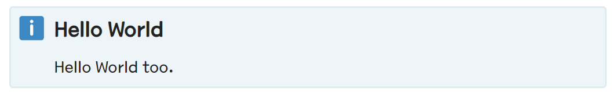
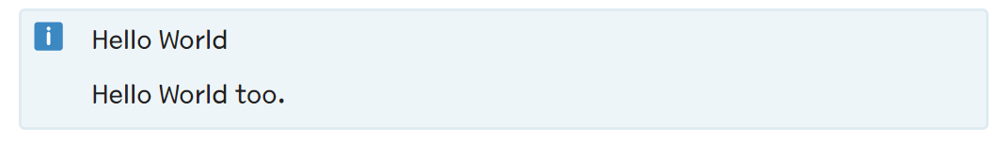
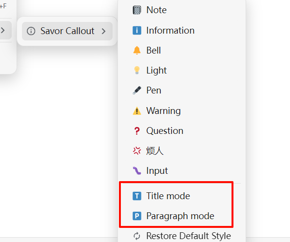
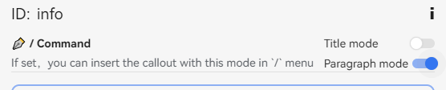
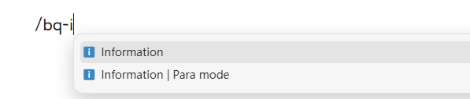
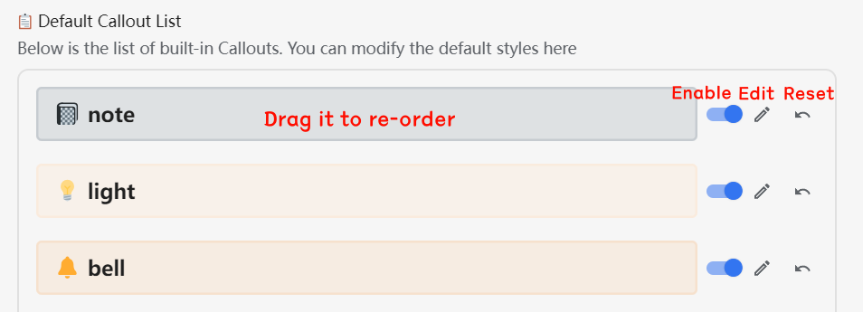
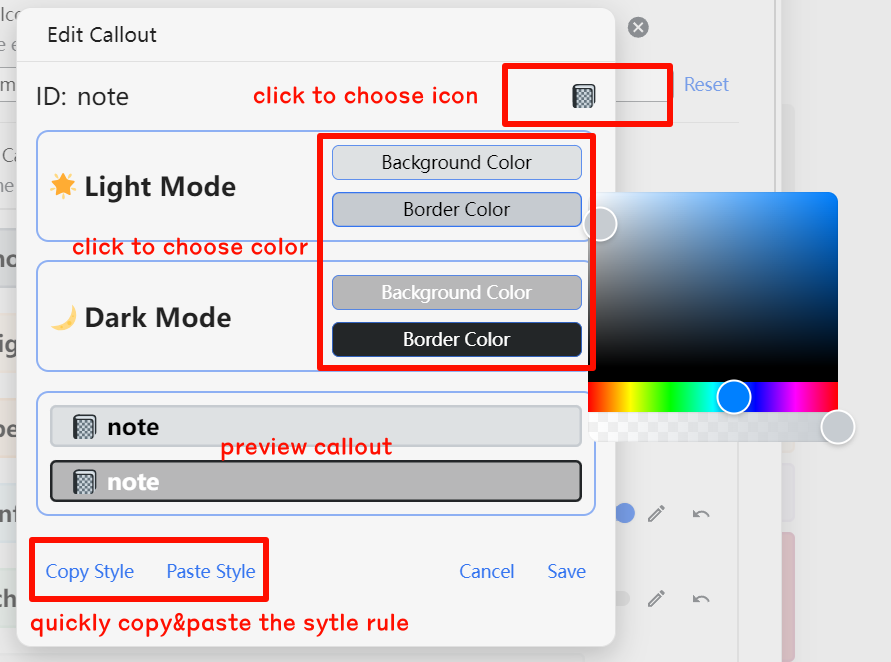
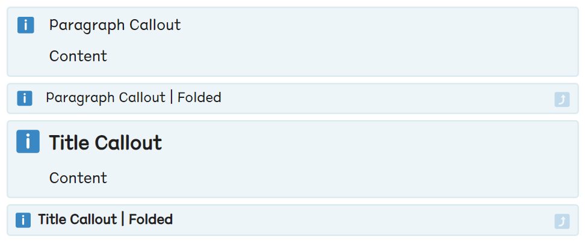

# Readme

Ported from the Savor theme, this plugin implements simple callout styles.

## Basic Usage

- Click on a quote block to convert it into a callout.
  - The content of the first child block of the quote block will be displayed as the title in the callout.
- Support for creating a new callout block using the `/` command.
  - `/bq-{callout id}`
  - `/callout-{callout id}`

## 🎨 Callout Icons

This plugin uses emoji icons as the callout icon.

Since the default emoji display in SiYuan is not satisfactory, **it is recommended to download the Emoji plugin from the marketplace for better display**. (Twitter Emoji, Google Emoji, Open Emoji etc.)

You can manually configure the "Callout Icon Font Style" field in the plugin settings to set the priority of the icon style. The default value is:

```
'Twitter Emoji', 'Noto Color Emoji', 'OpenMoji', sans-serif
```


## 🔋 Two Display Modes for Callout

The plugin supports two modes for Callout display:

1. Title Mode (Big Mode)

    In this mode, the first line of the Callout is displayed in bold and large text as a title.

    
2. Paragraph Mode (Small Mode)

    In this mode, the first line of the Callout is displayed as a regular paragraph.

    

### Global default display mode

You can select the default display mode in the plugin settings.

This setting will apply to all callouts except those designated with block attributes for display mode.

### Block level display mode

You can add the following block attributes to a specific Callout block to force the corresponding Callout block to be displayed in large/small text mode.

* `callout-mode="big"`: Specify display in Title Mode (Large Text)
* `callout-mode="small"`: Paragraph Mode (Small Text)


In this plugin, two ways are offered to create callout with block level mode.

1. Specify a mode in block menu

    

2. Insert callout in `/` commands menu

    1. Turn to checked in callout config panel `/`

        

    2. Then you can use the correspondent `/` command in editor

        


## ✨ Custom Callout

There are two types of callouts in this plugin:

1. **Default Callout**: Inherits the callout styles from the Savor theme, with the identifier attribute `custom-b`.
2. **Custom Callout**: Custom callout styles, with the identifier attribute `custom-callout`.

The plugin provides a good GUI interaction, allowing users to customize the styles of Callouts.

### Default Callout



- Enable/Disable
  - Callouts can be enabled or disabled using checkboxes.
  - Note: Disabled callouts will not appear in the block menu or `/` command, but their styles will still be effective.
- Drag and Drop Sorting
  - By dragging and dropping in the settings, the display order of Callouts in the menu can be adjusted.
- Edit Style
  - Callout styles can be edited in a separate settings panel.
  - This includes:
    - Callout icon
    - Callout background color
    - Callout border color
- Reset Style
  - Reset Callout styles to default values.

### Custom Callout


The configuration of custom icons is similar to Default Callout, with the following differences:

- Allows adding custom Callout styles.
- Allows modifying the Callout ID.
  - ⚠️ **Note**: Modifying the Callout ID will cause previous Callout blocks with the same ID to become invalid! Please proceed with caution!
- Allows deleting Callout styles.
  - ⚠️ **Note**: Deleting Callout styles will cause previous Callout blocks with the same ID to become invalid! Please proceed with caution!

## Callout Editor



1. Configure Callout ID (Default callouts cannot be configured)
2. Click and modify the Callout icon
3. Configure Callout color scheme
   1. Light mode and dark mode
   2. Internal background color and external border color
4. Copy & Paste Callout style


## 🎨 Other topics about style

### Custom CSS Snippets

If you have advanced customization needs for Callout styles, you can add custom CSS snippets to the plugin settings.
Essentially, this is no different from using code snippets in SiYuan.

### Collapsed Callout

When a Callout block is collapsed, only the first line of content is displayed; meanwhile, there's an icon on the right indicating that the block is collapsed.



You can customize the collapsible icon (emoji) to your preference using CSS variables, for example:

```css
:root {
  --callout-fold-icon: "🙂";
}
```
