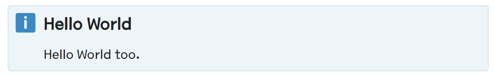
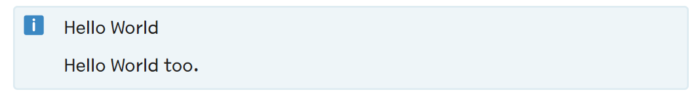
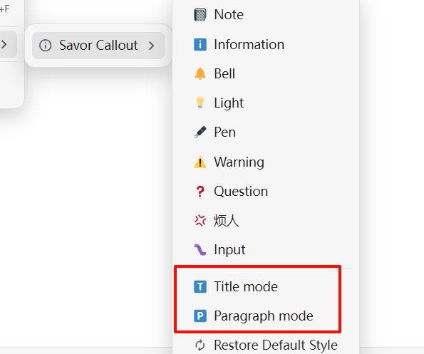
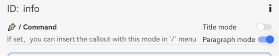
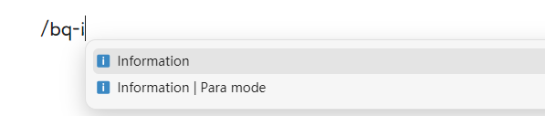
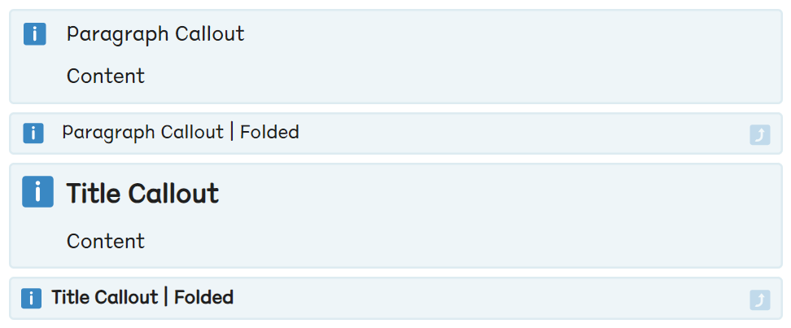

搬运自 Savor 主题，实现简单的 callout 样式。

> 如果下图中图片无法加载，你也可以选择到[线上文档](https://flowus.cn/share/e1961b24-8bf9-4d2f-9ca4-794d81824524?code=80RAFK)中查看

## 基础用法

- 点击引述块，将引述块转换成一个 callout
  - 引用块的第一个子块内容会作为标题显示在 callout 中
- 支持使用 `/` 命令新建一个 callout 块
  - `/bq-{callout id}`
  - `/callout-{callout id}`


## 🎨 Callout 图标

本插件使用 emoji 图标作为 callout 的图标显示。

由于思源默认内置的 emoji 显示效果并不佳，**推荐在集市中下载 Emoji 插件来获取更好的显示效果**。（包括 Twitter Emoji, Google Emoji, Open Emoji 等）

你可以在插件的设置选项中手动配置「Callout图标字体样式」字段来设置图标样式的优先级。默认值为：

```
'Twitter Emoji', 'Noto Color Emoji', 'OpenMoji', sans-serif
```


## 🔋 Callout 两种展示模式

插件支持两种 Callout 展示模式：

1. 标题模式（大字模式）

    在这个模式下，Callout 中第一行会以加粗、大字的标题形式展示。

    
2. 段落模式（小字模式）

    在这个模式下，Callout 中的第一行和普通段落无异。

    

### 全局默认展示模式

可以在插件设置中选择默认的展示模式。

该设置会对所有**没有设置了块级模式**的 Callout 生效。

### 块级展示模式

可以为特定的 Callout 块添加以下的块属性（这里省略了 custom- 前缀）来强制让对应的 Callout 块按照大/小字模式来展示。

* `callout-mode="big"`：指定展示为标题模式（大字模式）
* `callout-mode="small"`：段落模式（小字模式）

在插件中，提供了两种更加简单地方法来创建具有块级展示模式的 Callout:

1. 在 Menu 菜单当中设置

    

2. 在 `/` 命令菜单当中新建

    1. 在 callout 的设置面板中，开启特定模式的 `/`

        

    2. 在编辑器中，可以在 `/` 命令中插入特定模式的 callout

        


## ✨ 自定义 Callout

本插件中的 callout 分类两大类：

1. **默认 Callout**：继承自 Savor 主题的 callout 样式，标识属性为 `custom-b`
2. **自定义 Callout**：自定义的 callout 样式，标识属性为 `custom-callout`

插件提供了良好的 GUI 交互，允许用户自行配置 Callout 的相关样式。

### 默认 Callout


- 启用/禁用
  - 通过复选框来启用或禁用 Callout
  - 注意：被禁用的 callout 只是不会出现在块菜单和 `/` 命令中，但是样式仍然正常生效
- 拖放排序
  - 通过在设置中进行拖放排序，可以调整 Callout 在菜单中的显示顺序
- 编辑样式
  - 在独立的设置面板中，可以对 Callout 的样式进行编辑
  - 包括
    - Callout 的图标
    - Callout 的背景颜色
    - Callout 的边框颜色
- 重置样式
  - 重置 Callout 的样式为默认值

### 自定义 Callout


自定义图标的配置和默认 Callout 大部分一致，不同的地方在于：

- 允许添加自定义的 Callout 样式
- 允许修改 Callout 的 ID
  - ⚠️ **注意**：修改 Callout 的 ID 会导致过去同样 ID 的 Callout 块失效！请慎重！
- 允许删除 Callout 样式
  - ⚠️ **注意**：删除 Callout 样式会导致过去同样 ID 的 Callout 块失效！请慎重！

## Callout 编辑器


1. 配置 Callout ID （默认 callout 无法配置）
2. 点击并修改 Callout 图标
3. 配置 Callout 配色
   1. 亮色模式和暗色模式
   2. 内部背景色和外部边框色
4. Copy & Paste Callout 样式

## 🎨 其他样式相关

### 自定义 CSS 片段

如果你对 Callout 的样式有更高级的定制需求，可以在插件的设置中添加自定义的 CSS 片段。
本质上和使用思源的代码片段没有什么区别。

Callout 块的本质是思源的引述块，只不过会设置特殊的块属性并配置了对应的 CSS 样式。

由于历史原因，Callout 块有两种不同的块属性 `custom-b` 和 `custom-callout`，前者是继承自 Savor 主题的 callout 样式，后者是自定义的 callout 样式。

- 默认 Callout 的块属性选择器为 `.protyle-wysiwyg [data-node-id][custom-b="<CALLOUT_ID>"].bq`
- 自定义的 Callout 的块属性选择器为 `.protyle-wysiwyg [data-node-id][custom-callout="<CALLOUT_ID>"].bq`

### CSS 变量

Callout 插件配置了大量的 css 变量，如果你有更高的自定义需求，可以在代码片段中进行修改。

```scss
:root {
    // Styles applied as default
    --callout-default-icon-top: 0.35em;
    --callout-default-icon-left: 0.1em;
    --callout-default-icon-font-size: 1.4em;
    --callout-default-fc-font-size: 1.3em;
    --callout-default-fc-padding: 1.7em;
    --callout-default-fc-font-weight: 700;

    //Style applied for big mode callout
    --callout-big-icon-top: 0.35em;
    --callout-big-icon-left: 0.1em;
    --callout-big-icon-font-size: 1.4em;
    --callout-big-fc-font-size: 1.3em;
    --callout-big-fc-padding: 1.7em;
    --callout-big-fc-font-weight: 700;

    //Style applied for small mode callout
    --callout-small-icon-top: 0.45em;
    --callout-small-icon-left: 0.2em;
    --callout-small-icon-font-size: 1em;
    --callout-small-fc-font-size: 1em;
    --callout-small-fc-padding: 2.2em;
    --callout-small-fc-font-weight: inherit;

    //Style applied for folded callout
    --callout-fold-height: 34px;
    --callout-fold-icon-top: 10px;
    --callout-fold-font-size: 19px;
    --callout-fold-icon: "⤴";
}
```

例如在引述块被折叠的时候，会在右侧显示一个小小的折叠图标.




你可以在代码片段中配置你自己喜好的折叠图标（emoji），例如：

```css
:root {
  --callout-fold-icon: "🙂";
}
```
