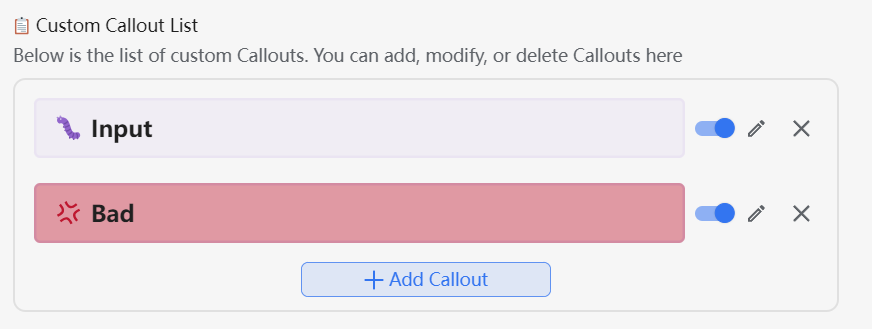

搬运自 Savor 主题，实现简单的 callout 样式

## 基础用法

- 点击引述块，将引述块转换成一个 callout
  - 引用块的第一个子块内容会作为标题显示在 callout 中
- 支持使用 `/` 命令新建一个 callout 块
  - `/bq-{callout id}`
  - `/callout-{callout id}`


## 🎨 Callout 图标

本插件使用 emoji 图标作为 callout 的图标显示。

由于思源默认内置的 emoji 显示效果并不佳，推荐在集市中下载 Emoji 插件来获取更好的显示效果。

你可以在插件的设置选项中手动配置「Callout图标字体样式」字段来设置图标样式的优先级。默认值为：

```
'Twitter Emoji', 'Noto Color Emoji', 'OpenMoji', sans-serif
```


## ✨ 自定义 Callout

本插件中的 callout 分类两大类：

1. **默认 Callout**：继承自 Savor 主题的 callout 样式，标识属性为 `custom-b`
2. **自定义 Callout**：自定义的 callout 样式，标识属性为 `custom-callout`

插件提供了良好的 GUI 交互，允许用户自行配置 Callout 的相关样式。

### 默认 Callout


- 启用/禁用
  - 通过复选框来启用或禁用 Callout
  - 注意：被禁用的 callout 只是不会出现在块菜单和 `/` 命令中，但是样式仍然正常生效
- 拖放排序
  - 通过在设置中进行拖放排序，可以调整 Callout 在菜单中的显示顺序
- 编辑样式
  - 在独立的设置面板中，可以对 Callout 的样式进行编辑
  - 包括
    - Callout 的图标
    - Callout 的背景颜色
    - Callout 的边框颜色
- 重置样式
  - 重置 Callout 的样式为默认值

### 自定义 Callout



自定义图标的配置和默认 Callout 大部分一致，不同的地方在于：

- 允许添加自定义的 Callout 样式
- 允许修改 Callout 的 ID
  - ⚠️ **注意**：修改 Callout 的 ID 会导致过去同样 ID 的 Callout 块失效！请慎重！
- 允许删除 Callout 样式
  - ⚠️ **注意**：删除 Callout 样式会导致过去同样 ID 的 Callout 块失效！请慎重！

## Callout 编辑器


1. 配置 Callout ID （默认 callout 无法配置）
2. 点击并修改 Callout 图标
3. 配置 Callout 配色
   1. 亮色模式和暗色模式
   2. 内部背景色和外部边框色
4. Copy & Paste Callout 样式

## 🎨 自定义 CSS 片段

如果你对 Callout 的样式有更高级的定制需求，可以在插件的设置中添加自定义的 CSS 片段。
本质上和使用思源的代码片段没有什么区别。

